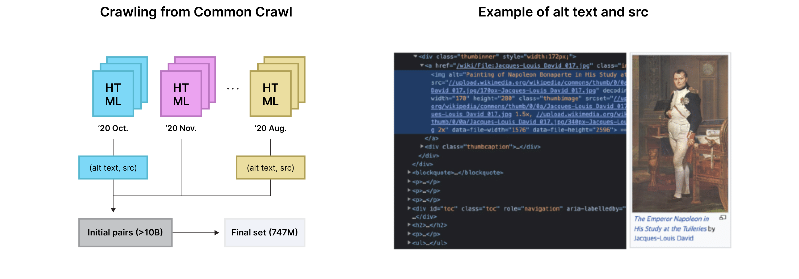
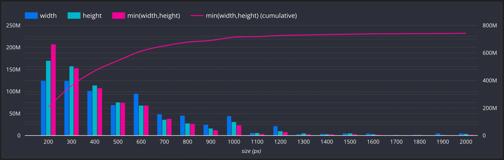
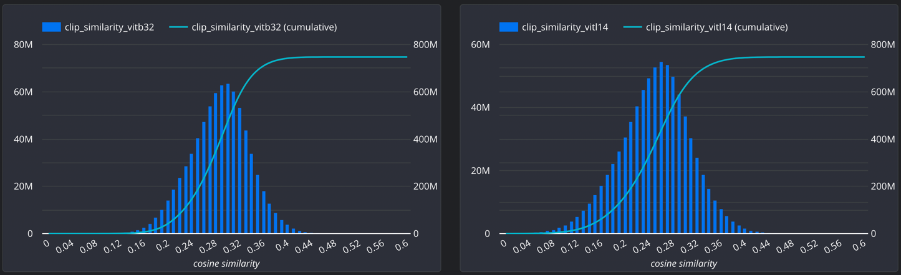
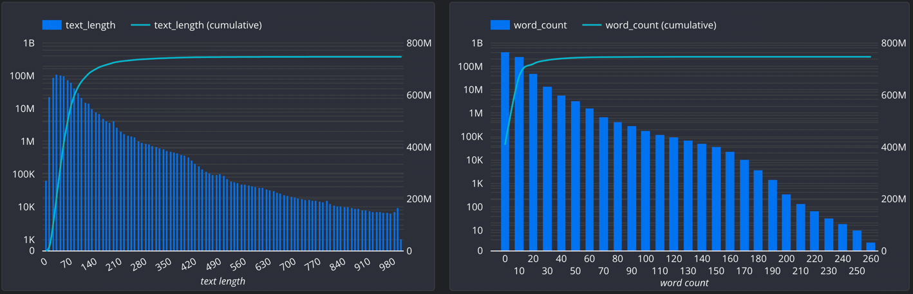
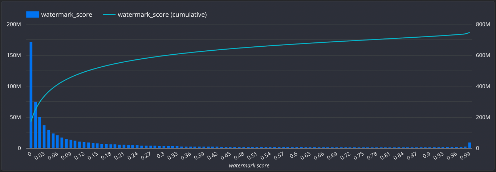
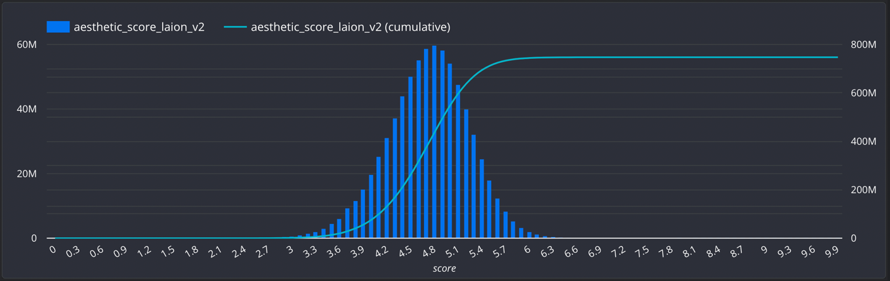

# :wolf: COYO-700M: Image-Text Pair Dataset

**COYO-700M** is a large-scale dataset that contains **747M image-text pairs** as well as 
many other **meta-attributes** to increase the usability to train various models.
Our dataset follows a similar strategy to previous vision-and-language datasets,
collecting many informative pairs of alt-text and its associated image in HTML documents.
We expect COYO to be used to train popular large-scale foundation models 
complementary to other similar datasets.

More details on the data acquisition process can be found in [our paper] (which will be updated soon).

<p align="center"></p>

## Updates
* Aug 2022: Release COYO-700M Dataset 

## Data Collection Process

* We collected about 10 billion pairs of alt-text and image sources in HTML documents in [CommonCrawl](https://commoncrawl.org/) from Oct. 2020 to Aug. 2021.
and eliminated uninformative pairs through the image and text level filtering process with minimal cost.
The following figure outlines our data collection procedure.

<div align="center">
<figure>

<figcaption>https://en.wikipedia.org/wiki/Napoleon</figcaption>
</figure>
</div>

## Data Filtering
### Image Level
* Include all image formats that Pillow library can decode (JPEG, WEBP, PNG, BMP, ...)
* Less than 5KB image size are dropped
* Images with an aspect ratio greater than 3.0 are dropped
* Images with min(width, height) < 200 are dropped
* Images are dropped if the score of [OpenNSFW2](https://github.com/bhky/opennsfw2) or [GantMan/NSFW](https://github.com/GantMan/nsfw_model) is higher than 0.5
* Based on the image [pHash](http://www.phash.org/) value, we removed all duplicate images from external public datasets.
    * ImageNet-1K/21K, Flickr-30K, MS-COCO, CC-3M, CC-12M


### Text Level
* We collected only English text using [cld3](https://github.com/google/cld3)
* Consecutive whitespace characters are replaced with a single whitespace and whitespace before and after the sentence are removed
    * e.g. `"\n            \n                Load image into Gallery viewer, valentine&amp;#39;s day roses\n            \n" → "Load image into Gallery viewer, valentine&amp;#39;s day roses"`
* Any text with a length of 5 or less has been dropped
* Text that does not have a noun form has been dropped
* Text less than 3 words or more than 256 words and text over 1000 words were dropped
* All texts appearing more than 10 times have been dropped
    * e.g. `“thumbnail for”, “image for”, “picture of”`
* We dropped data containing NSFW words.
  * [profanity_filter](https://github.com/rominf/profanity-filter/blob/master/profanity_filter/data/en_profane_words.txt), [better_profanity](https://github.com/snguyenthanh/better_profanity/blob/master/better_profanity/profanity_wordlist.txt), [google_twunter_lol](https://gist.github.com/ryanlewis/a37739d710ccdb4b406d)


### Image-Text Level
* Based on (image_phash, text), duplicated samples have been dropped
    * Different text may exist for the same image URL.


## Dataset Preview
| id            | url                                                                                                                                                                 | text                                                                                                                                                                               | width | height | image_phash      | text_length | word_count | num_tokens_bert | num_tokens_gpt | num_faces | clip_similarity_vitb32 | clip_similarity_vitl14 | nsfw_score_opennsfw2 | nsfw_score_gantman | watermark_score | aesthetic_score_laion_v2 |
|---------------|---------------------------------------------------------------------------------------------------------------------------------------------------------------------|------------------------------------------------------------------------------------------------------------------------------------------------------------------------------------|-------|--------|------------------|-------------|------------|-----------------|----------------|-----------|------------------------|------------------------|----------------------|--------------------|-----------------|--------------------------|
| 2559800550877 |                                                                        | William Phillips - Fuel State Critical - Outcome in Doubt (B-25                                                                                                                    | 600   | 300    | e9e90c24f1d9c674 | 63          | 10         | 14              | 18             | 0         | 0.300293               | 0.258545               | 0.000364065          | 0.0101354          | 0.0191545       | 7.1703                   |
| 4896263451343 |                            | Fishing Fleet (Monterey), California art by Art Riley. HD giclee art prints for sale at CaliforniaWatercolor.com - original California paintings, & premium giclee prints for sale | 600   | 447    | bac58374982e0fc7 | 178         | 25         | 39              | 40             | 0         | 0.319336               | 0.248169               | 2.54512e-05          | 0.0293861          | 0.0406009       | 7.04812                  |
| 1425929344479 |  | The Gate by Pete2453                                                                                                                                                               | 600   | 347    | 8374726575bc0f8a | 20          | 4          | 6               | 6              | 0         | 0.24939                | 0.203735               | 6.97374e-06          | 0.00823276         | 0.0721415       | 6.98521                  |
| 7456063527931 |                       | Beautiful Pictures From the Shores of the Mythical Land (42                                                                                                                        | 600   | 320    | 949d1fe559e2cc90 | 59          | 10         | 11              | 14             | 0         | 0.290771               | 0.179321               | 0.0130615            | 0.0178628          | 0.489642        | 6.94643                  |
| 3221225511175 |                        | contemporary expensive lighting fixtures with minimum lighting                                                                                                                     | 800   | 499    | e5ea35075ab912c6 | 62          | 7          | 7               | 8              | 0         | 0.263916               | 0.217896               | 0.000990868          | 0.0137114          | 0.0960748       | 4.57594                  |
| 4191888300802 | https://img.youtube.com/vi/G5t8RZ1ThcU/0.jpg                                                                                                                        | Himmel und Huhn - Ace in Action                                                                                                                                                    | 480   | 360    | d0693e966993ce61 | 31          | 6          | 9               | 10             | 1         | 0.183105               | 0.172607               | 0.0121689            | 0.0402696          | 0.360724        | 4.0938                   |


## Dataset Numbers

|                                       |           count |   ratio |
|---------------------------------------|----------------:|--------:|
| # of image-text pairs                 | **746,972,269** | 100.00% |
| # of unique urls                      |     656,114,783 |  87.84% |
| # of unique image_phash               |     579,679,137 |  77.60% |
| # of unique text                      |     566,253,888 |  75.81% |


## Meta-Attributes
### Attributes
| name                     | type    | description                                                                                                                                                                                |
|--------------------------|---------|--------------------------------------------------------------------------------------------------------------------------------------------------------------------------------------------|
| id                       | long    | Unique 64-bit integer ID generated by [monotonically_increasing_id()](https://spark.apache.org/docs/3.1.3/api/python/reference/api/pyspark.sql.functions.monotonically_increasing_id.html) |
| url                      | string  | The image URL extracted from the `src` attribute of the `` tag                                                                                                                        |
| text                     | string  | The text extracted from the `alt` attribute of the `` tag                                                                                                                             |
| width                    | integer | The width of the image                                                                                                                                                                     |
| height                   | integer | The height of the image                                                                                                                                                                    | 
| image_phash              | string  | The [perceptual hash(pHash)](http://www.phash.org/) of the image                                                                                                                           |
| text_length              | integer | The length of the text                                                                                                                                                                     |
| word_count               | integer | The number of words separated by spaces.                                                                                                                                                   |
| num_tokens_bert          | integer | The number of tokens using [BertTokenizer](https://huggingface.co/docs/transformers/model_doc/bert#transformers.BertTokenizer)                                                             |
| num_tokens_gpt           | integer | The number of tokens using [GPT2TokenizerFast](https://huggingface.co/docs/transformers/model_doc/gpt2#transformers.GPT2TokenizerFast)                                                     |
| num_faces                | integer | The number of faces in the image detected by [SCRFD](https://insightface.ai/scrfd)                                                                                                         |
| clip_similarity_vitb32   | float   | The cosine similarity between text and image(ViT-B/32) embeddings by [OpenAI CLIP](https://github.com/openai/CLIP)                                                                         |
| clip_similarity_vitl14   | float   | The cosine similarity between text and image(ViT-L/14) embeddings by [OpenAI CLIP](https://github.com/openai/CLIP)                                                                         |
| nsfw_score_opennsfw2     | float   | The NSFW score of the image by [OpenNSFW2](https://github.com/bhky/opennsfw2)                                                                                                              |
| nsfw_score_gantman       | float   | The NSFW score of the image by [GantMan/NSFW](https://github.com/GantMan/nsfw_model)                                                                                                       | 
| watermark_score          | float   | The watermark probability of the image by our internal model                                                                                                                               |
| aesthetic_score_laion_v2 | float   | The aesthetic score of the image by [LAION-Aesthetics-Predictor-V2](https://github.com/christophschuhmann/improved-aesthetic-predictor)                                                    |


### Statistics
* Statistics for numeric and string columns

  |      |  width | height | text_length | word_count | num_tokens_bert | num_tokens_gpt | num_faces |
  |------|-------:|-------:|------------:|-----------:|----------------:|---------------:|----------:|
  | mean | 621.78 | 540.99 |       68.53 |      11.13 |           15.75 |          17.24 |      0.60 |
  | min  |    200 |    200 |           6 |          3 |               1 |              3 |         0 |
  | max  |  21449 |  22507 |        1000 |        323 |             811 |           1523 |       736 |

  |      | watermark_score | clip_similarity_vitb32 | clip_similarity_vitl14 | aesthetic_score_laion_v2 | nsfw_score_opennsfw2 |
  |-----:|----------------:|-----------------------:|-----------------------:|-------------------------:|---------------------:|
  | mean |        0.178544 |               0.291266 |               0.254632 |                 4.769132 |             0.012903 |
  |  min |             0.0 |              -0.080871 |              -0.176269 |                 1.171712 |                  0.0 |
  |  max |             1.0 |               0.591796 |               0.581542 |                 8.082607 |             0.499755 |

* Image Size
  
* CLIP Similarity
  
* Text Length & Word Size
  
* Watermark score
  
* Aesthetic score
  
* For more detailed statistics on COYO-700M, please see the [Data Studio report on COYO-700M](https://datastudio.google.com/s/jvwkG5XCzYI).


## Getting Started
### Download
* You can download the dataset from [Huggingface Dataset](https://huggingface.co/datasets/kakaobrain/coyo-700m)
* For more information on downloading the image dataset, please refer to [download/README.md](./download/README.md).

### Usage
- [pytorch](/examples/webdataset_torch.py)
- [tensorflow](/examples/webdataset_tf.py)


## Experiments
We empirically validated the quality of COYO dataset by re-implementing popular models including [ALIGN](https://arxiv.org/abs/2102.05918), [unCLIP](https://arxiv.org/abs/2204.06125), and [ViT](https://arxiv.org/abs/2010.11929). 
We trained these models on COYO-700M or its subsets from scratch, 
achieving competitive performance to the reported numbers or generated samples in the original papers. 
Since this observation supports the high quality of our dataset, we expect that this will be continuously updated in open collaboration.
We plan to release a pre-trained model and training code.
For more detailed training methods, please refer to the technical paper to be released later.

### ALIGN 
| Model                       | Data       | ImageNet KNN |   COCO I2T |   COCO T2I |
|:----------------------------|------------|-------------:|-----------:|-----------:|
| EfficientNet-B7 + BERT-base | ALIGN-1.8B |   **69.300** |     55.400 |     41.700 |
| EfficientNet-B7 + BERT-base | COYO-700M  |       68.618 | **59.000** | **42.419** |
* Our experiment setup followed [ALIGN](https://arxiv.org/abs/2102.05918).
  * We increased the batch size from 16K to 64K and reduced training steps by 1/4 for faster training.

### unCLIP ([OpenAI DALL·E 2](https://openai.com/dall-e-2/))

| <div style="width:150px"></div> | <div style="width:150px"></div> | 
|:----------------------------------------------------------------------------------------:|:--------------------------------------------------------------------------------------------:| 
| A high quality picture of a medieval knight with golden armor                            | A person with the head of a cat in the style of Andy Warhol<tr></tr>                         |
|                              | <tr></tr>                       |  
| A pencil drawing of an astronaut riding a horse                                          | Goryeo celadon in the shape of darth vader                                                   |

* We implemented the smaller version of unCLIP to validate the effectiveness of COYO for the text-conditional generation tasks. 
* Specifically, we tried to reproduce three components of the original [unCLIP](https://arxiv.org/abs/2204.06125): diffusion-based prior, decoder with some modifications, and super-resolution model for upscaling 64x64 into 256x256px.
* Detailed information on our modified version of unCLIP and quantitative analysis would be included in the upcoming technical report. 

### ViT

| Model    | Data             | ImageNet <br/> Validation <br/>Top-1 Acc |
|----------|------------------|-----------------------------------------:|
| ViT-L/16 | JFT-300M         |                               **87.76%** |
| ViT-L/16 | COYO-Labels-300M |                                   87.09% |

* We also provide COYO-Labels-300M by adding **machine-generated vision labels** to a subset of COYO-700M for comparison with the JFT-300M.
  * We first removed the duplicated images by `image_phash`.
  * Then, we labeled 300M unique images into 21,841 classes by [EfficientNetV2-XL](https://arxiv.org.abs/2104.00298) trained with [ImageNet-21K](https://www.image-net.org/) dataset.
* Our experiment setup followed [ViT](https://arxiv.org/abs/2010.11929).
  * We increased training epochs to 14.


## Citation

If you apply this dataset to any project and research, please cite our code:

```
@misc{kakaobrain2022coyo-700m,
  title         = {COYO-700M: Image-Text Pair Dataset},
  author        = {Minwoo Byeon, Beomhee Park, Haecheon Kim, Sungjun Lee, Woonhyuk Baek, Saehoon Kim},
  year          = {2022},
  howpublished  = {\url{https://github.com/kakaobrain/coyo-dataset}},
}
```

## People
  - Minwoo Byeon ([@mwbyeon](https://github.com/mwbyeon))
  - Beomhee Park ([@beomheepark](https://github.com/beomheepark))
  - Haecheon Kim ([@HaecheonKim](https://github.com/HaecheonKim))
  - Sungjun Lee ([@justhungryman](https://github.com/justHungryMan))
  - Woonhyuk Baek ([@wbaek](https://github.com/wbaek))
  - Saehoon Kim ([@saehoonkim](https://github.com/saehoonkim))
  - and Kakao Brain Large-Scale AI Studio


## Disclaimer & Content Warning
The COYO dataset is recommended to be used for research purposes. 
Kakao Brain tried to construct a "Safe" dataset when building the COYO dataset. 
(See [Data Filtering](#data-filtering) Section) Kakao Brain is constantly making efforts to create more "Safe" datasets. 
However, despite these efforts, this large-scale dataset was not hand-picked by humans to avoid the risk due to its very large size (over 700M). 
Keep in mind that the unscreened nature of the dataset means that the collected images can lead to strongly discomforting and disturbing content for humans. 
The COYO dataset may contain some inappropriate data, and any problems resulting from such data are the full responsibility of the user who used it. 
Therefore, it is strongly recommended that this dataset be used only for research, keeping this in mind when using the dataset, and Kakao Brain does not recommend using this dataset as it is without special processing to clear inappropriate data to create commercial products.


## License
The COYO dataset of Kakao Brain is licensed under [CC-BY-4.0 License](https://creativecommons.org/licenses/by/4.0/).
The full license can be found in the [LICENSE.cc-by-4.0 file](./LICENSE.cc-by-4.0).
The dataset includes “Image URL” and “Text” collected from various sites by analyzing Common Crawl data, an open data web crawling project. 
The collected data (images and text) is subject to the license to which each content belongs.


## Obligation to use
While Open Source may be free to use, that does not mean it is free of obligation. 
To determine whether your intended use of the COYO dataset is suitable for the CC-BY-4.0 license, please consider the license guide. 
If you violate the license, you may be subject to legal action such as the prohibition of use or claim for damages depending on the use.


## Contact
COYO dataset was released as an open source in the hope that it will be helpful to many research institutes and startups for research purposes. 
We look forward to contacting us from various places who wish to cooperate with us.

[coyo@kakaobrain.com](mailto:coyo@kakaobrain.com)